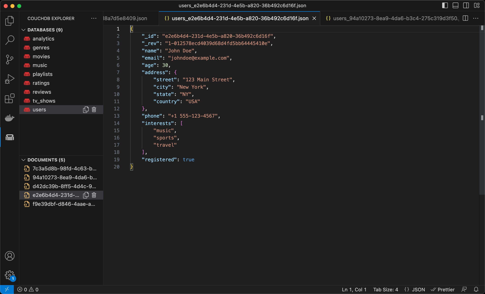

# CouchDB Explorer

[](https://marketplace.visualstudio.com/items?itemName=arbko.couchdb-vs) 
[](https://github.com/arturbiko/couchdb-vs)

CouchDB Explorer is a plugin for the Visual Studio Code editor that allows for quick navigation of the CouchDB directly from the editor. With CouchDB Explorer, you can easily browse the available databases in your CouchDB instance and view their contents.

## Getting Started

---

To get started with CouchDB Explorer, simply install the plugin from the Visual Studio Code Marketplace. Once installed, you can access the plugin from the Explorer sidebar.

To configure the plugin, add the following properties to your **user** settings:

```
"couchdb-vs.protocol": "<your-couchdb-protocol>",
"couchdb-vs.host": "<your-couchdb-host>",
"couchdb-vs.username": "<your-couchdb-username>",
"couchdb-vs.password": "<your-couchdb-password>"
```

## Features

---

### Navigation of all data

- See all available databases
- Create and delete databases
- Display and delete documents of a selected database


